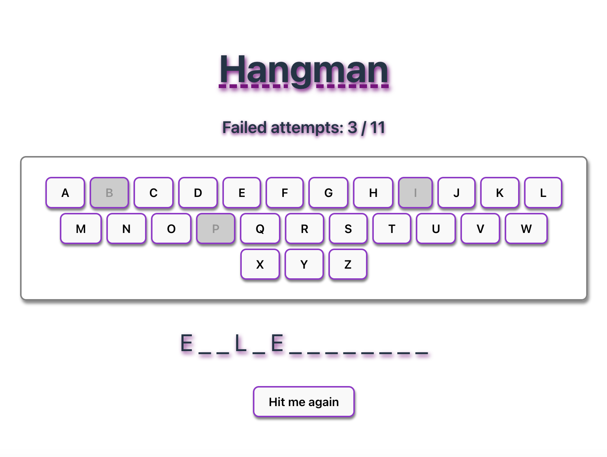

# Project H_ngm_n

Welcome to Hangman, a mini-project that brings back the classic word-guessing game we all know from our childhood. This project was created with minimal HTML, CSS, and mainly TypeScript. The design was partially specified, but I added some colors and shadows to enhance the user experience.

## Preview:



## Features

- Random Word Selection: A hidden word is chosen randomly for each game.

- Word Length Display: The length of the hidden word is indicated by underscores.

- Attempts Indicator: The underscores also represent the number of incorrect attempts allowed.

- Interactive Keyboard: Letters are selected via clickable buttons that resemble a keyboard.

- Reset Button: Easily restart the game at any time with the reset button.

## Technologies Used

- HTML: Basic structure of the application.

- CSS: Styling for the user interface, including added colors and shadows.

- TypeScript: Logic for game functionality and interaction.

## Deployment

Check out the live demo on Netlify: Hangman on Netlify

## Getting Started

To get started with this project, follow these steps:

- Clone the repository:

sh

```
git clone git@github.com:sharonVko/Project_Hangman.git
```

- Navigate to the project directory:

```
cd hangman
```

- Install dependencies:

```
npm install
```

- Run the development server:

```
npm run dev
```
